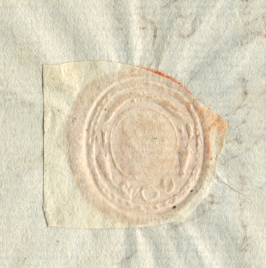
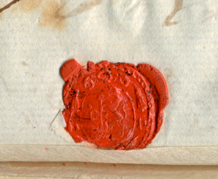
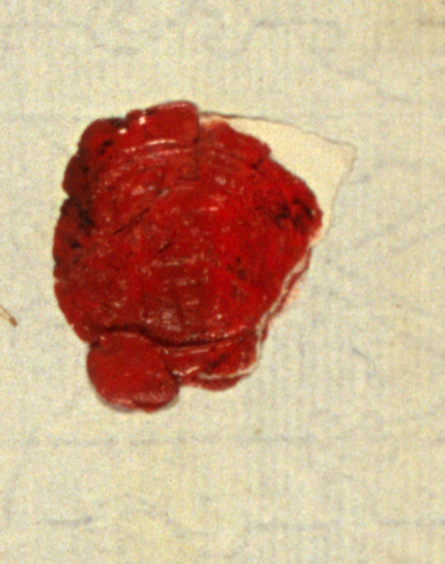
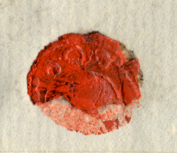
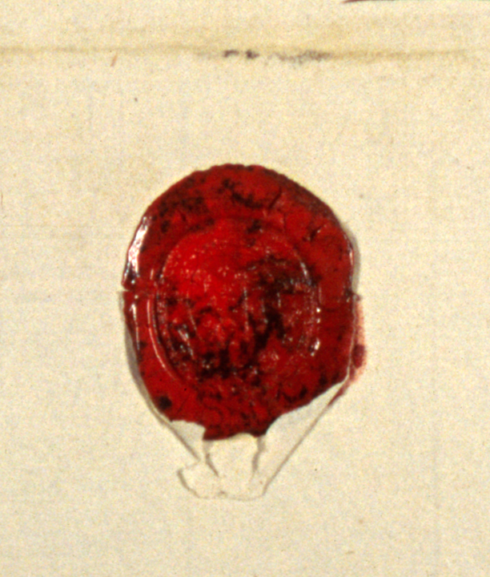
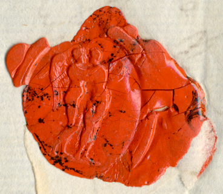
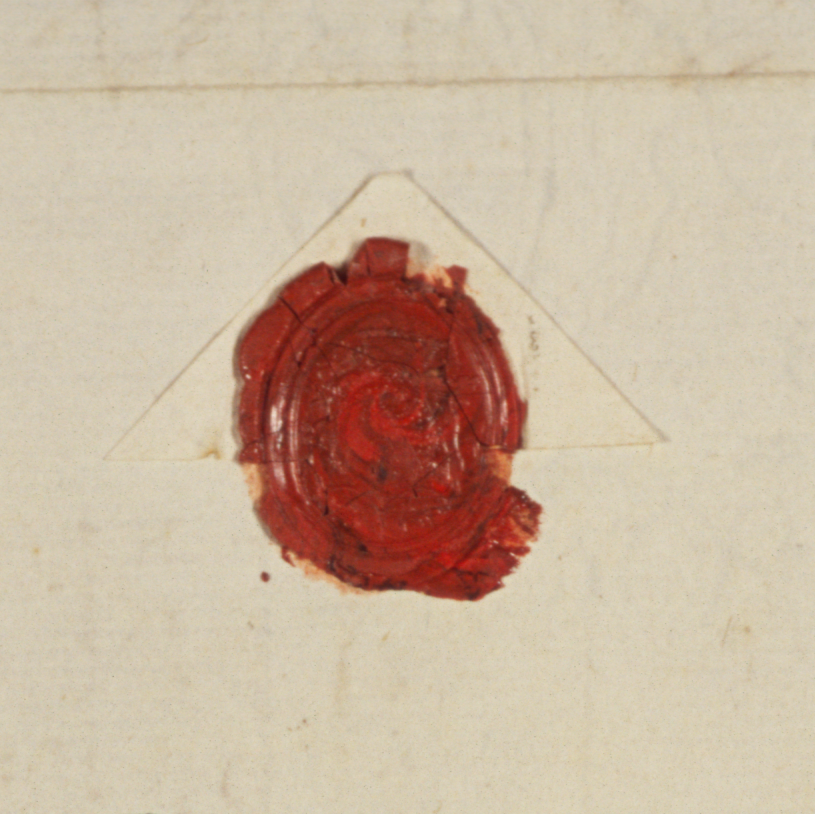
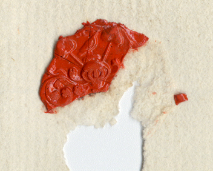

<figure>

<figcaption>Straßburg, Anfang Juni 1774</figcaption>
</figure>

<figure>

<figcaption>Mitte September 1775, Straßburg</figcaption>
</figure>

<figure>

<figcaption>Straßburg, 29. September 1775</figcaption>
</figure>

<figure>

<figcaption>Ende September 1775, Straßburg</figcaption>
</figure>

<figure>

<figcaption>Straßburg, 18. November 1775</figcaption>
</figure>

<figure>

<figcaption>Kurz nach dem 24. Mai 1776, Weimar</figcaption>
</figure>

<figure>

<figcaption>Schweiz, 26. Mai 1777</figcaption>
</figure>

<figure>

<figcaption>Moskau, 18. November 1785</figcaption>
</figure>

