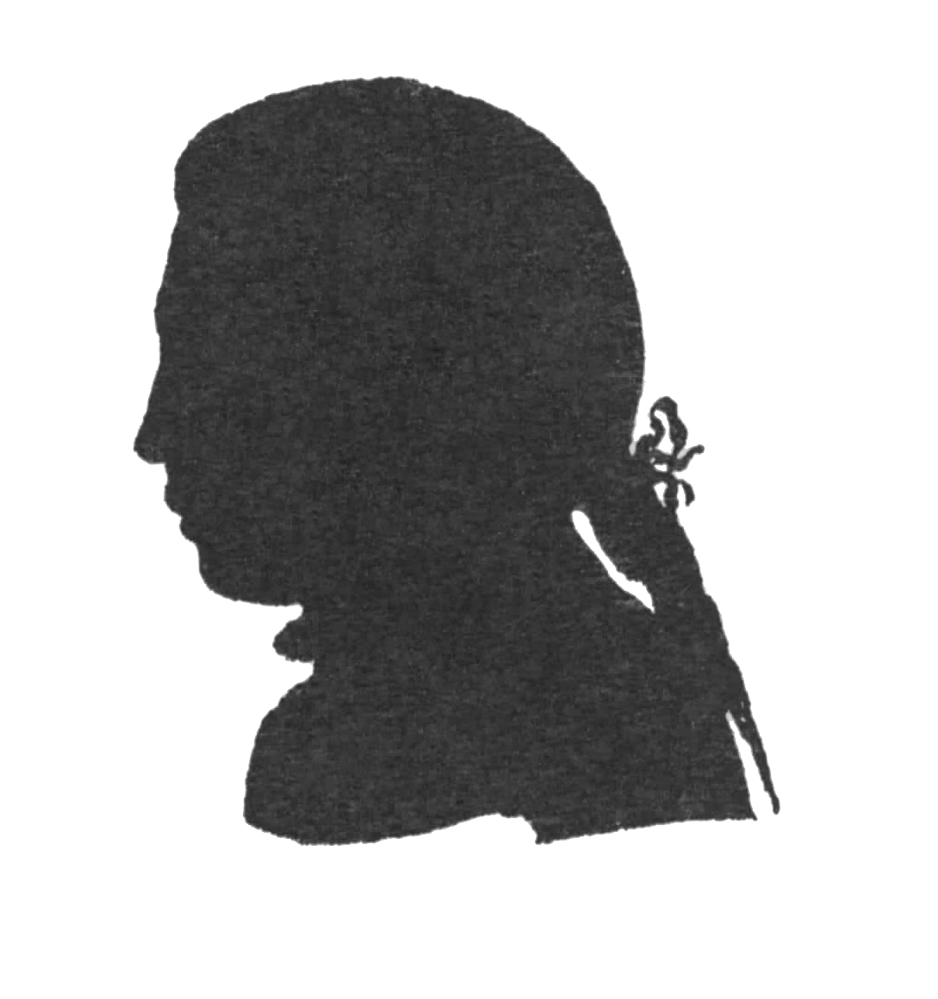

# Jakob Lenz Archiv

<figure class="page-portrait">

</figure>

Das Jakob Lenz Archiv Heidelberg versammelt das Nachlassmaterial des Stürmer und Drängers Jakob (Jacob) Michael Reinhold Lenz (1751–92) sowie die zu ihm erschienene Forschungsliteratur, um die umfassende wissenschaftliche Erschließung der Werke und der Biographie von Lenz weiter voranzubringen. \
[Lenz Archiv online &rarr;](https://lenz-archiv.de/)

Die Grundlagenforschung zu Lenz hat mit dem Archiv einen physischen und mit der Website einen virtuellen Ort, um die Nachlass- und Forschungsmaterialien möglichst vollständig zu erschließen und zu bewahren. Das Lenz Archiv gibt derzeit die Kritische Briefausgabe sowie die Kritische Ausgabe der Dramenentwürfe heraus.

## Kontakt

Dr. Gregor Babelotzky\
[lenz-archiv@tss-hd.de](mailto:lenz-archiv@tss-hd.de)\
[+49 (0) 6221 5 99 68 10](tel:+4962215996810)

Jakob Lenz Archiv\
Theodor Springmann Stiftung\
Hirschgasse 2\
69120 Heidelberg
