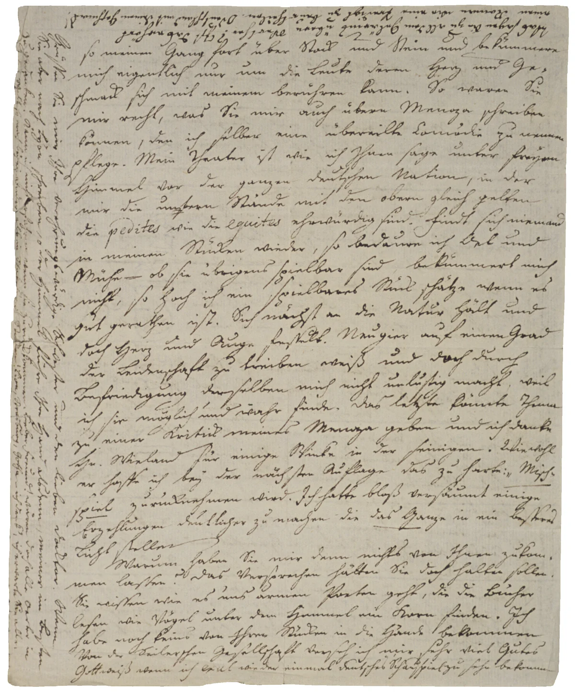
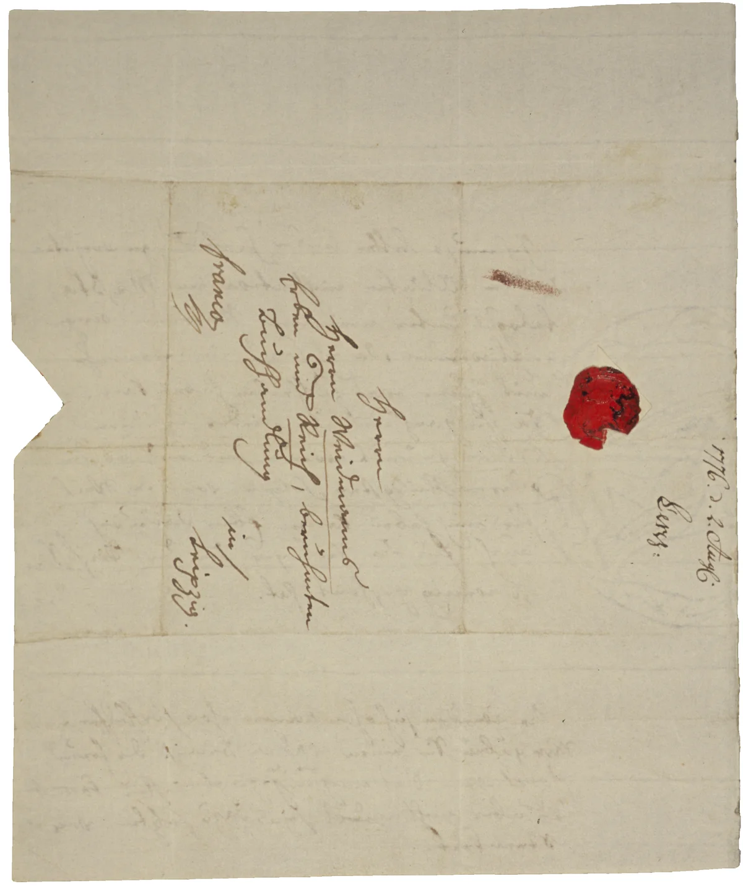

# Zur Edition

Ediert werden alle 374 überlieferten Briefe von und an Jakob Michael Reinhold Lenz. Perspektivisch sollen die Briefe auch kommentiert werden.

Lenz’ Schriften sind bisher zum großen Teil nicht historisch-kritisch ediert. Die derzeit üblicherweise als Referenz herangezogene Ausgabe von Sigrid Damm hält weder den aktuellen Ansprüchen wissenschaftlicher Forschung stand noch vermittelt sie ein adäquates Bild des Lenz’schen Werks. Vielmehr wird dessen Disparatheit zugunsten einer ‚Lesefreundlichkeit‘ geglättet, die darauf zielt, einem vermeintlich einfachen Zugang zu Lenz’ Werk den Vorzug gegenüber der tatsächlichen – komplexen – Überlieferungslage zu geben. Dieser Mangel betrifft auch den Briefwechsel.

Die bisherigen Briefausgaben – von Freye und Stammler ([FREYE/STAMMLER 1918](#freyestammler)) sowie der dritte Band von Damms Werk- und Briefausgabe ([DAMM 1987](#damm)) – reflektieren nicht den gegenwärtigen Stand der Forschung (die Edition der [MOSKAUER SCHRIFTEN](#moskauerschriften) gibt dagegen die dort entstandenen Briefe zwischen 1781 und 1792 historisch-kritisch wieder); sie sind zudem beide nicht vollständig. So sind etwa verloren geglaubte Briefmanuskripte wieder aufgetaucht ebenso wie bis dato gänzlich unbekannte Briefe.

Die Überlieferung der Lenz-Briefe ist vielgestaltig: Autographen bilden den wesentlichen Teil; quantitativ folgt – da zahlreiche Manuskripte  verschollen sind – die Drucküberlieferung in Aufsätzen und frühen Ausgaben. Daneben gibt es einige Briefe, die nur in zeitgenössischen Abschriften und Exzerpten erhalten sind. Einige wenige Briefe bzw. Briefpassagen wiederum sind nur als Zitate in Fremdtexten überliefert. Diese Vielfalt wirft Probleme hinsichtlich einer einheitlichen typographischen Einrichtung und Auszeichnung auf, die hoffentlich möglichst adäquat und zugleich pragmatisch Darstellung gefunden haben.

Aufgenommen sind nur tatsächliche Briefe (also keine Stammbucheinträge oder ähnliches); Gedichte werden nur aufgenommen, wenn sie gesichert in einem Briefkontext eingebettet sind. Nicht Teil der Edition sind fiktionale und programmatische Briefe, etwa im Kontext der Sozialreform (vgl. [SCHRIFTEN ZUR SOZIALREFORM](#schriften-zur-sozialreform)).

Die Kritische Briefausgabe nimmt konsequent Bezug auf die materielle Überlieferung, d.h. die Briefe werden ohne Vereinheitlichungen oder Kürzungen dargeboten, indem die Edition direkt das Manuskript oder die primäre Drucküberlieferung heranzieht. Die Topographie der Aufzeichnungen wird annähernd wiedergegeben; das gilt auch für Anrede und Abrede oder für Respektsabstände. Unterstreichungen bzw. Durchstreichungen sind wortgenau. Ein verschliffenes „und“ („u“) wird bei großer Wahrscheinlichkeit aufgelöst; das gilt auch für Symbole für „nicht“. Geminationsstriche über „m“ und „n“ sind als „mm“ bzw. „nn“ realisiert. Systematisch verschliffene Endsilben werden bei großer Wahrscheinlichkeit des Wortbilds ohne eigene Auszeichnung ergänzt.

Bei autographen Manuskripten ist der Seitenumbruch markiert. Einfügungen werden differenziert beschrieben: als über, unter oder neben der Zeile. Streichungen werden differenziert wiedergegeben, ebenso alle Ersetzungen, Überarbeitungen und Schriftwechsel. Lenz’ Eigenheit v.a. den linken Rand der Briefe mit Schrift zu füllen, findet Berücksichtigung, indem der Ort der Schrift semi-diplomatisch festgehalten wird. Längere französische Passagen werden übersetzt, russische, altgriechische und lateinische Begriffe perspektivisch im Kommentar erläutert.

<figure class="editorial-image">

<a class="letter-image-original editorial-image-original" href="/randnotizen-lenz-an-gotter-1775-05-10-full.webp" target="_blank" rel="noopener">In voller Auflösung öffnen</a>

<figcaption>Randnotizen im Brief von <a href="/briefe/49/">Lenz an Gotter, 10. Mai 1775</a>.</figcaption>
</figure>

Alle Briefe erscheinen in ihrem materialen Kontext, sodass z. B. bei Doppelbriefen auch der mitgeschickte zweite Brief ediert wird. Verzeichnet sind auch ermittelte Briefeinlagen. Brieffremde Elemente auf dem Überlieferungsträger sind Teil der Edition, z.B. Zeichnungen oder Notizen. Oft hat Lenz um Briefentwürfe herum zahlreiche andere Notizen hinterlassen, oder aber Briefempfänger verwenden das Papier für andere Zwecke weiter. Kalkulationen und umfangreichere Notizen zur Sozialreform werden nicht wiedergegeben; es wird stattdessen auf die Edition der Schriften zur Sozialreform verwiesen.

Die Briefumschläge – bzw. bei gefalteten Kuverts die Außenseite mit Adresse – werden detailliert beschrieben, z.B. Poststempel, Siegel, Frankiervermerke oder Aufschriften, mit Hilfe derer der Postweg verfolgt werden kann. Der Querstrich zwischen „in“ und Ortsangabe wird nicht wiedergegeben, da er nur eine der Klarheit dienende Konvention der Adressierung ist.

<figure class="editorial-image">

<a class="letter-image-original editorial-image-original" href="/umschlag-lenz-an-weidmanns-erben-und-reich-1776-07-26-full.webp" target="_blank" rel="noopener">In voller Auflösung öffnen</a>

<figcaption>Briefumschlag von <a href="/briefe/223/">Lenz an Weidmanns Erben und Reich, 26. Juli 1776</a>.</figcaption>
</figure>

Die Manuskripte der Briefe finden sich im Verzeichnis des Lenz Archivs eingehend beschrieben: [Handschriften - Jakob Lenz Archiv](https://lenz-archiv.de/verzeichnisse/handschriften/). Für Forschungsfragen steht die Bibliographie zur Verfügung: <https://lenz-archiv.de/verzeichnisse/forschungsbibliographie/>

## Mitarbeit

*Technische Umsetzung:* Simon Martens \
*Wissenschaftliche Hilfskräfte:* Gregor Michalski, Paula Schlosser \
*Französische Übersetzungen:* Joscha Sörös \
*Russische Transkription:* Stefan Grießl

## Siglen

<lkb-siglen></lkb-siglen>

## Legende

<lkb-legende></lkb-legende>
